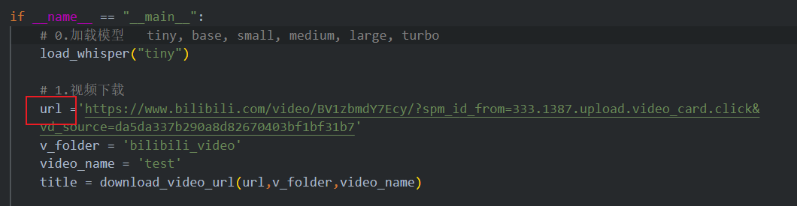

# 0 概述
本项目实现b站视频语音转文字的功能，输入视频网址即可实现语音文字的提取，基于openai的开源whisper大模型实现语音转换。项目仅用于技术学习，不得用于商业用途。

# 1. python环境配置
```
pip install -r requirements.txt
```
# 2. ffmpeg配置
参考链接[Windows下安装使用ffmpeg](https://zhuanlan.zhihu.com/p/118362010)
# 3. 使用
将视频的`url`粘贴到`bili2txt.py`的main中，运行即可

# 4.结果查看
默认视频保存在`bilibili_video`文件夹
默认音频和分割后的音频保存在`bilibili_audio`文件夹
默认转换后的文字保存在`bilibili_text`文件夹

本项目参考了`openai`的[whisper](https://github.com/openai/whisper)开源项目，大神`Lanbin07`的开源库[bili2text](https://github.com/lanbinshijie/bili2text),完一并表示膜拜。